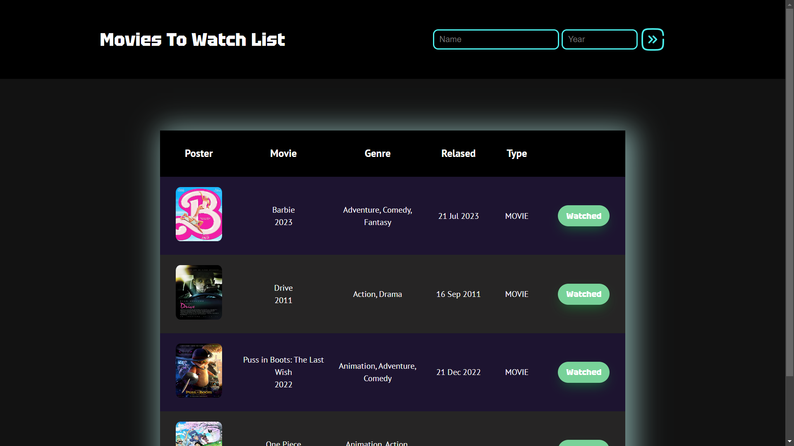
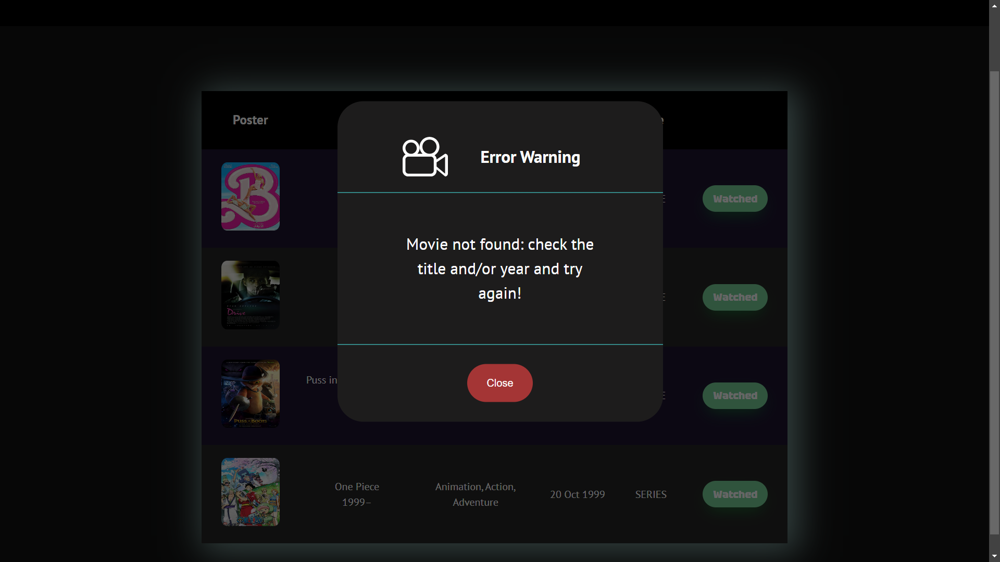
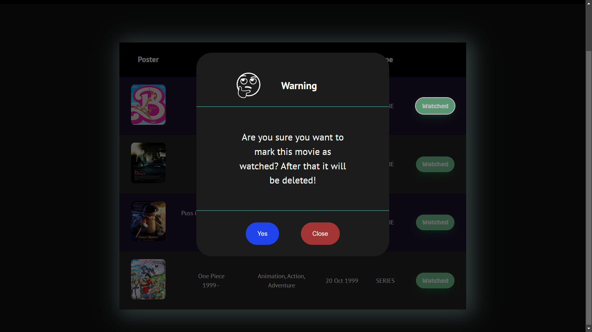

# Movies To Watch List - Projeto Pessoal

## Select your language:
- [Portuguese](#Portuguese) | [English](#English) | [Spanish](#Spanish)

# Portuguese

## Descrição do Projeto
Movies To Watch List é um projeto pessoal que utiliza HTML e CSS para personalização e Javascript no lado do cliente para conexão com a API gratuita [OMDb API](https://www.omdbapi.com/) de filmes e outras mídias audiovisuais. Além disso, o Javascript é utilizado para implementar outras lógicas envolvidas, assim como no armazenamento dos dados no LocalStorage do navegador.
Durante o desenvolvimento da aplicação, foram priorizados aspectos como acessibilidade, responsividade, clean code, reutilização de código, orientação a objetos e imutabilidade.

## Aplicação do Projeto
O projeto tem como objetivo permitir ao usuário registrar filmes que deseja assistir em algum momento, por meio da barra de pesquisa, onde é possível pesquisar por Título e Ano (opcional). Ao clicar no botão de envio, os dados são enviados como requisição para a API, que retorna as informações na tabela. O botão com o texto "Watched", presente em cada linha da tabela, permite a exclusão do filme com a confirmação do usuário.

## Uso
Caso queira utilizar o projeto em sua máquina, será necessário visitar o site da [OMDb](https://www.omdbapi.com/) e se registrar gratuitamente para obter a API KEY. Crie um arquivo na pasta 'js' e importe a constante com a sua chave para o arquivo 'moviesdata.js'.

## Imagens

## Recursos Úteis
- [Estrutura do Projeto](https://www.youtube.com/watch?v=czZ1PvNW5hk) - Utilizei este tutorial como base para criar a tabela responsiva em CSS.
- [Ideias para Botões em CSS](https://getcssscan.com/css-buttons-examples) - Utilizei o botão 33 para inserir nas linhas da tabela.
- [Gerador de Box Shadow](https://cssgenerator.org/box-shadow-css-generator.html) - Este site me ajudou a criar o box-shadow dos elementos utilizados.
- [Classe "sr-only" para Telas](https://kittygiraudel.com/snippets/sr-only-class/) - Utilizei as regras CSS deste artigo para garantir a acessibilidade para leitores de tela.

## Contribuição
Fique à vontade para fazer sugestões de melhorias para o projeto.

# English

## Project Description
Movies To Watch List is a personal project that uses HTML and CSS for customization, and client-side Javascript to connect with the free [OMDb API](https://www.omdbapi.com/) for movies and other audiovisual media. Additionally, Javascript is used to implement other involved logics, such as data storage in the browser's LocalStorage.
Throughout the application's development, aspects like accessibility, responsiveness, clean code, code reuse, object orientation, and immutability were prioritized.

## Project Application
The project aims to allow users to record movies they want to watch at some point, using the search bar, where it's possible to search by Title and Year (optional). Upon clicking the submit button, the data is sent as a request to the API, which returns the information in a table. The "Watched" button, present in each table row, allows the user to delete the movie with user confirmation.

## Usage
If you want to use the project on your machine, you will need to visit the [OMDb website](https://www.omdbapi.com/) and register for free to obtain the API KEY. Create a file in the 'js' folder and import the constant with your key into the 'moviesdata.js' file.

## Images

## Useful Resources
- [Project Structure](https://www.youtube.com/watch?v=czZ1PvNW5hk) - I used this tutorial as a basis to create the responsive table in CSS.
- [CSS Button Ideas](https://getcssscan.com/css-buttons-examples) - I used button 33 to insert into the table rows.
- [Box Shadow Generator](https://cssgenerator.org/box-shadow-css-generator.html) - This site helped me create the box-shadow for the used elements.
- ["sr-only" Class for Screen Readers](https://kittygiraudel.com/snippets/sr-only-class/) - I used the CSS rules from this article to ensure accessibility for screen readers.

## Contribution
Feel free to make suggestions for project improvements.

# Spanish
## Descripción del Proyecto
Movies To Watch List es un proyecto personal que utiliza HTML y CSS para la personalización, y Javascript del lado del cliente para conectarse con la API gratuita [OMDb API](https://www.omdbapi.com/) para películas y otros medios audiovisuales. Además, Javascript se utiliza para implementar otras lógicas involucradas, como el almacenamiento de datos en el LocalStorage del navegador.
Durante el desarrollo de la aplicación, se priorizaron aspectos como accesibilidad, capacidad de respuesta, código limpio, reutilización de código, orientación a objetos e inmutabilidad.

## Aplicación del Proyecto
El objetivo del proyecto es permitir que los usuarios registren películas que desean ver en algún momento, utilizando la barra de búsqueda, donde es posible buscar por Título y Año (opcional). Al hacer clic en el botón de envío, los datos se envían como solicitud a la API, que devuelve la información en una tabla. El botón "Watched" presente en cada fila de la tabla permite eliminar la película con la confirmación del usuario.

## Uso
Si deseas utilizar el proyecto en tu máquina, será necesario visitar el sitio web de [OMDb](https://www.omdbapi.com/) y registrarte de forma gratuita para obtener la API KEY. Crea un archivo en la carpeta 'js' e importa la constante con tu clave en el archivo 'moviesdata.js'.

## Imágenes

## Recursos Útiles
- [Estructura del Proyecto](https://www.youtube.com/watch?v=czZ1PvNW5hk) - Utilicé este tutorial como base para crear la tabla receptiva en CSS.
- [Ideas para Botones en CSS](https://getcssscan.com/css-buttons-examples) - Utilicé el botón 33 para insertarlo en las filas de la tabla.
- [Generador de Sombra en Caja](https://cssgenerator.org/box-shadow-css-generator.html) - Este sitio me ayudó a crear el box-shadow para los elementos utilizados.
- [Clase "sr-only" para Lectores de Pantalla](https://kittygiraudel.com/snippets/sr-only-class/) - Utilicé las reglas CSS de este artículo para garantizar la accesibilidad para lectores de pantalla.

## Contribución
Siéntete libre de hacer sugerencias para mejorar el proyecto.
